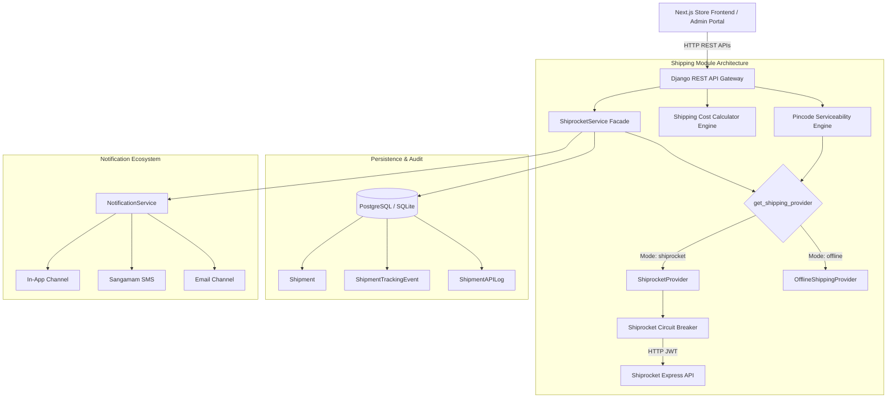
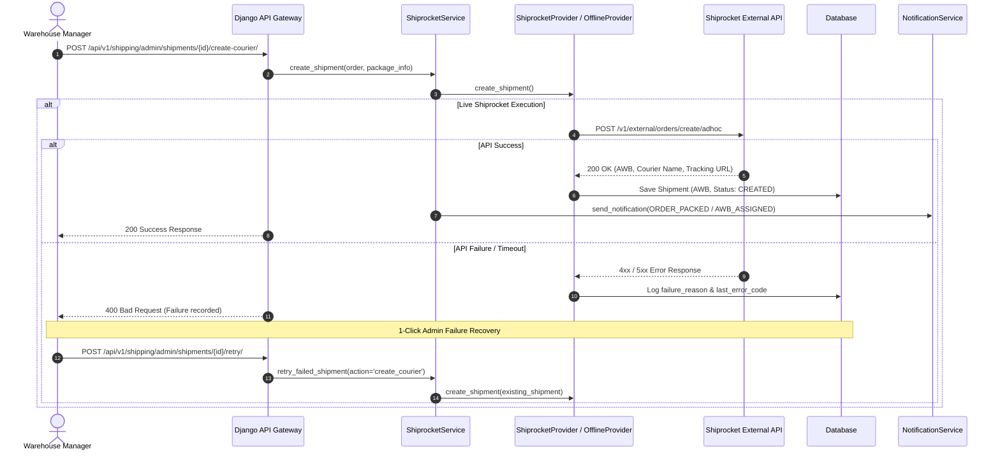
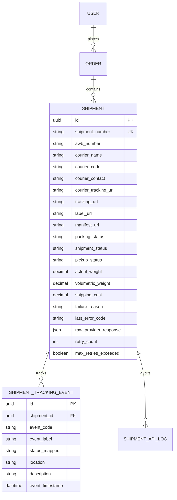

# FAAZO Enterprise Shipment & Logistics Module — Production Documentation

## 1. System Architecture Diagram



---

## 2. Sequence Diagram: Courier Shipment Creation & Failure Recovery



---

## 3. Database Entity Relationship Diagram (ERD)



---

## 4. REST API Contract Documentation

### 4.1 Check Pincode Serviceability & Delivery ETA
* **Endpoint**: `POST /api/v1/shipping/pincode-check/`
* **Auth**: Public (`AllowAny`)
* **Request Payload**:
  ```json
  {
    "pincode": "400001",
    "weight": 1.5,
    "cod": true,
    "declared_value": 2500.0
  }
  ```
* **Response (200 OK)**:
  ```json
  {
    "success": true,
    "data": {
      "deliverable": true,
      "provider": "shiprocket",
      "origin_pincode": "400001",
      "destination_pincode": "400001",
      "estimated_delivery_date": "2026-08-06",
      "cod_available": true,
      "shipping_charge": 60.0,
      "courier_name": "Delhivery Surface",
      "couriers": [...]
    },
    "message": "Pincode serviceability checked."
  }
  ```

### 4.2 Calculate Shipping Cost Breakdown
* **Endpoint**: `POST /api/v1/shipping/calculate-cost/`
* **Auth**: Public (`AllowAny`)
* **Request Payload**:
  ```json
  {
    "subtotal": 1200.0,
    "weight": 1.2,
    "length": 15.0,
    "width": 10.0,
    "height": 10.0,
    "destination_pincode": "110001",
    "is_cod": false
  }
  ```
* **Response (200 OK)**:
  ```json
  {
    "success": true,
    "data": {
      "order_subtotal": 1200.0,
      "free_shipping_threshold": 999.0,
      "is_free_shipping": true,
      "actual_weight_kg": 1.2,
      "volumetric_weight_kg": 0.3,
      "chargeable_weight_kg": 1.2,
      "zone": "ZONE_C",
      "freight_charge": 96.0,
      "applied_freight_charge": 0.0,
      "cod_fee": 0.0,
      "total_shipping_fee": 0.0
    }
  }
  ```

### 4.3 Customer Shipment Tracking
* **Endpoint**: `GET /api/v1/orders/{order_id}/shipment/`
* **Auth**: Authenticated User (`IsAuthenticated`)
* **Response (200 OK)**:
  ```json
  {
    "success": true,
    "data": {
      "shipment_number": "SHP-2026-00045",
      "awb_number": "AWB987654321",
      "courier_name": "Shiprocket Express",
      "courier_code": "SR_EXPRESS",
      "tracking_url": "https://shiprocket.co/tracking/AWB987654321",
      "label_url": "https://faazo-media.s3.amazonaws.com/labels/SHP-00045.pdf",
      "status": "in_transit",
      "current_location": "Bhiwandi Sorting Hub, MH",
      "estimated_delivery_date": "2026-08-06",
      "tracking_events": [...]
    }
  }
  ```

### 4.4 Admin 1-Click Failure Recovery Retry
* **Endpoint**: `POST /api/v1/shipping/admin/shipments/{id}/retry/`
* **Auth**: Admin (`IsAdmin`)
* **Request Payload**:
  ```json
  {
    "action": "create_courier"
  }
  ```
* **Response (200 OK)**:
  ```json
  {
    "success": true,
    "message": "Courier shipment recreated successfully.",
    "data": {
      "shipment_id": "b3e21f45-6789-[#]"
    }
  }
  ```

---

## 5. Warehouse Workflow & Production Checklist

```
 [1. PENDING]        Order placed & paid. Warehouse packing record created.
      │
 [2. PACKING]        Warehouse staff gathers items and performs QC verification.
      │
 [3. QC_PASSED]      Package dimensions & actual weight recorded.
      │
 [4. READY_PICKUP]   Package sealed. Admin triggers "Create Courier Shipment".
      │
 [5. CREATED]        Shiprocket API assigns AWB, courier partner, and shipping label.
      │
 [6. PICKUP_BOOKED]  Admin triggers "Schedule Courier Pickup".
      │
 [7. IN_TRANSIT]     Webhooks automatically update tracking events and notify customer.
      │
 [8. DELIVERED]      Final delivery status updated. Order marked complete.
```

### Production Readiness Checklist
- [x] Database models updated with failure recovery & courier management fields.
- [x] Django migrations created and applied (`shipping.0005`).
- [x] Pincode serviceability engine with Shiprocket & Offline simulation fallback.
- [x] Reusable shipping cost calculation engine with zone rules & free shipping threshold.
- [x] Integrated notification service dispatch on shipment milestones.
- [x] Admin 1-click failure recovery retry views.
- [x] Next.js PincodeChecker component created.
- [x] Next.js OrderDetailPage updated with live tracking timeline, copy AWB button, and external link.
